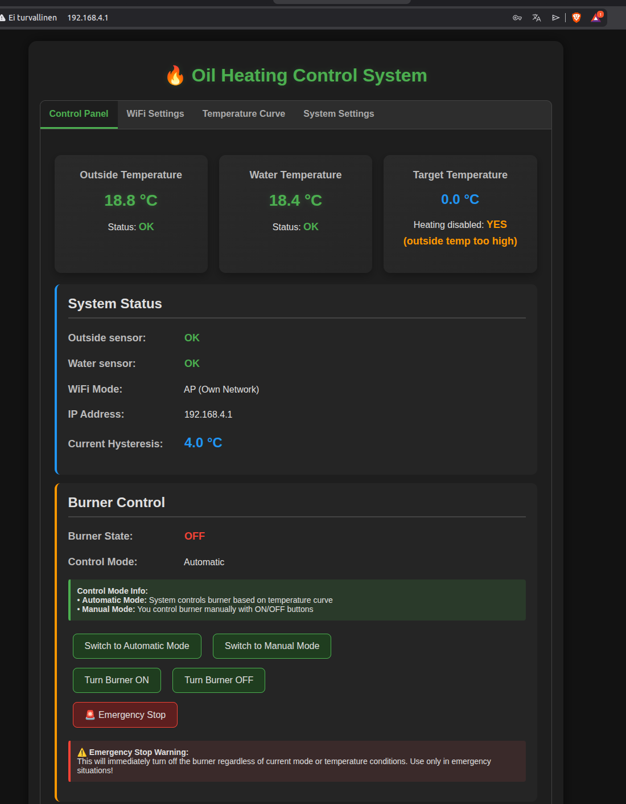

# Oil Heating System - ESP32 FreeRTOS Controller

# Oil Heating System - ESP32 Control System

## 📋 Project Overview
Complete thread-safe implementation for ESP32-based oil heating system with pump control, temperature monitoring, and web interface.

## 🎯 Key Features

### 🔥 Heating Control
- **Temperature Measurement**: DS18B20 sensors for outside and water temperature
- **Automatic Control**: Hysteresis-based heating control
- **10-Minute Delay**: Prevents short cycling when outside temperature is warm
- **Safety Measures**: Temperature limits and sensor error detection
- **Manual/Auto Modes**: Full user control or automatic operation

### 💧 Pump Control
- **Automatic Mode**: Runs with burner or when heating needed
- **Daily Exercise**: 5-minute run at 11:00 AM to prevent seizing
- **Anti-Stuck Feature**: 5-minute run every 7 days if idle
- **Minimum Run Time**: 5 minutes to prevent short cycling
- **Manual Override**: FORCE ON/OFF modes for maintenance

### ⏰ System Clock
- **Software Clock**: Maintains date and time
- **Pump Scheduling**: Daily exercise based on system time
- **Web Interface**: Full time setting capability
- **Weekday Calculation**: Automatic weekday from date

### 🌐 Network Features
- **Dual WiFi Modes**: AP (own network) or STA (connect to existing)
- **Web Interface**: Dark theme control panel
- **REST API**: JSON endpoints for system monitoring
- **Settings Persistence**: Saved to flash memory

### 🛡️ Safety & Reliability
- **Thread-Safe Design**: Mutex-protected data access
- **Watchdog Monitoring**: Task health monitoring
- **Emergency Stop**: Overrides all operations
- **Sensor Fault Detection**: Automatic error handling
- **Flash Storage**: Settings survive power loss

## 🏗️ Hardware Configuration

### 📍 GPIO Pin Assignments
| Component | GPIO Pin | Description |
|-----------|----------|-------------|
| Outside Sensor | GPIO 23 | DS18B20 temperature sensor |
| Water Sensor | GPIO 22 | DS18B20 temperature sensor |
| Relay Control | GPIO 2 | Burner relay (HIGH = ON) |
| Pump Control | GPIO 4 | Pump relay (HIGH = ON) |

### 🔧 Sensor Configuration
- **Resolution**: 12-bit (0.0625°C accuracy)
- **Reading Interval**: 5 seconds
- **Safety Limits**: -50°C to 120°C (water), -50°C to 100°C (outside)

## 📊 Control Parameters

### 🌡️ Temperature Curve
4-point linear interpolation for target water temperature:

| Outside Temp | Target Water Temp | Description |
|-------------|-------------------|-------------|
| -20°C | 75°C | Very cold - maximum heating |
| -10°C | 65°C | Cold weather |
| 0°C | 55°C | Freezing point |
| 10°C | 45°C | Warm - above this = 10-min delay |

### ⚙️ Control Settings
- **Hysteresis**: 4.0°C (adjustable 0.5-10.0°C)
- **10-Minute Delay**: Activates when outside temp ≥ 10°C
- **Pump Exercise**: Daily at 11:00 AM for 5 minutes
- **Anti-Stuck**: Every 7 days if pump idle

## 🧵 FreeRTOS Task Architecture

### 📋 Task Configuration
| Task | Priority | Stack Size | Core | Description |
|------|----------|------------|------|-------------|
| Watchdog | Critical (4) | 2048 bytes | 0 | System health monitoring |
| Relay Control | High (3) | 2048 bytes | 1 | Burner relay management |
| Pump Control | High (3) | 3072 bytes | 1 | Pump operation |
| Temperature | High (3) | 3072 bytes | 1 | Sensor reading |
| Control Logic | Medium (2) | 3072 bytes | 1 | Heating algorithm |
| Clock | Low (1) | 2048 bytes | 1 | Time management |
| Flash Storage | Low (1) | 2048 bytes | 1 | Settings persistence |
| Web Server | Low (1) | 4096 bytes | 0 | HTTP interface |

### 🔒 Thread Safety
- **SystemState Class**: Centralized data management
- **Mutex Protection**: Separate mutexes for each data group
- **Atomic Snapshots**: Safe data access across tasks
- **Clear Locking Order**: Prevents deadlocks

## 🌐 Web Interface

### 🖥️ Control Panel Features
1. **Main Dashboard**
   - Real-time temperature display
   - Burner status and control
   - Pump status and mode control
   - System clock display

2. **Clock Settings Tab**
   - Full date/time configuration
   - Weekday display and calculation
   - Time validation

3. **WiFi Configuration**
   - AP/STA mode selection
   - Network credentials management
   - Automatic restart on save

4. **Temperature Curve**
   - 4-point curve configuration
   - Real-time validation
   - Visual feedback

5. **System Settings**
   - Hysteresis adjustment
   - Safety parameter viewing
   - System information

### 🔌 REST API Endpoints

#### 📊 System Data
- `GET /data` - JSON system status
- `GET /getcurve` - Current temperature curve
- `GET /getsettings` - System settings
- `GET /getwifi` - WiFi configuration

#### 🎛️ Control Commands
- `GET /control?manual=1/0` - Switch manual/auto mode
- `GET /control?burner=1/0` - Manual burner control
- `GET /emergency` - Emergency shutdown
- `GET /setcurve` - Update temperature curve
- `GET /setsettings` - Update system settings
- `GET /setwifi` - Update WiFi settings

#### 💧 Pump Control
- `GET /pump/mode?mode=X` - Set pump mode (0-3)
- `GET /pump/exercise` - Start manual exercise
- `GET /pump/state?state=1/0` - Manual pump control
- `GET /pump/status` - Pump status JSON

#### ⏰ Time Management
- `GET /time/set` - Set system time
- `GET /time/get` - Get current time
- `GET /testtime` - Time validation test

## 🔧 Installation & Setup

### 📦 Prerequisites
- ESP32 Development Board
- DS18B20 Temperature Sensors (x2)
- Relay Module for burner control
- Relay Module for pump control
- 5V Power Supply
- Jumper Wires

### ⚡ Wiring Diagram
```
ESP32 GPIO23 ─── DS18B20 (Outside) ─── GND
ESP32 GPIO22 ─── DS18B20 (Water) ──── GND
ESP32 GPIO2 ──── Relay IN1 ────────── Burner
ESP32 GPIO4 ──── Relay IN2 ────────── Pump
ESP32 3.3V ───── DS18B20 VCC ──────── 4.7kΩ ─── Data
ESP32 GND ────── Relay GND ────────── Power Supply GND
```

### 🚀 Initial Setup
1. **Upload Code**: Compile and upload to ESP32
2. **Connect to Network**: 
   - Default AP: `OilHeaterAP` / Password: `enmuista`
   - Or configure STA mode in web interface
3. **Access Web Interface**: http://192.168.4.1 (AP mode) or device IP
4. **Configure Settings**: Set temperature curve, hysteresis, time
5. **Test Operation**: Verify sensor readings and control functions

## 🔍 Debug Features

### 🐛 Debug Output
```cpp
#define DEBUG_TEMP 0      // Temperature readings
#define DEBUG_CONTROL 1   // Control logic decisions
#define DEBUG_PUMP 1      // Pump operations
```

### 📝 Serial Monitor Output
- System initialization status
- Temperature readings
- Control decisions
- Pump operations
- WiFi connection status
- Error messages

## 🛠️ Maintenance

### 🔄 Regular Checks
1. **Sensor Accuracy**: Verify temperature readings
2. **Pump Exercise**: Confirm daily operation
3. **WiFi Connection**: Monitor network stability
4. **System Time**: Verify clock accuracy
5. **Flash Storage**: Confirm settings persistence

### ⚠️ Troubleshooting
| Symptom | Possible Cause | Solution |
|---------|---------------|----------|
| No WiFi | AP mode not starting | Check ESP32 WiFi module |
| Sensor Errors | Wiring issues | Verify connections, check pull-up resistor |
| Pump Not Running | Mode setting | Check pump mode in web interface |
| Time Drift | Software clock inaccuracy | Regular time synchronization |
| Relay Not Switching | GPIO configuration | Verify pin assignments |

## 📈 Performance Characteristics

### ⏱️ Timing
- **Temperature Reading**: Every 5 seconds
- **Control Loop**: Every 1 second
- **Pump Check**: Every 100ms
- **WiFi Reconnect**: Every 30 seconds
- **Flash Save**: 5 seconds after changes

### 💾 Memory Usage
- **Task Stacks**: 2-4KB per task
- **SystemState**: ~1KB data + mutex overhead
- **Web Server**: ~4KB stack + HTML in PROGMEM
- **FreeRTOS**: ~10KB system overhead

## 🔒 Safety Features

### 🚨 Emergency Protocols
1. **Sensor Fault**: Automatic shutdown on serious error
2. **Temperature Limits**: Hard limits on max temperatures
3. **Watchdog**: System reset if tasks hang
4. **Manual Override**: User can force shutdown
5. **Heating Disabled**: Automatic when outside temp too high

### 🛡️ Protection Mechanisms
- **Mutex Timeouts**: Prevent task hangs
- **Queue Overflow Protection**: Limited queue sizes
- **Parameter Validation**: All inputs validated
- **Flash Corruption Protection**: CRC checks on settings
- **Network Security**: Password-protected AP

## 📚 Code Structure

### 🏗️ Main Components
```
oil_heating_system.ino
├── Hardware Configuration
├── Data Structures
├── SystemState Class
├── Task Implementations
├── Web Server Routes
├── Setup Function
└── Main Loop
```

### 📁 Key Classes
- **SystemState**: Thread-safe data management
- **TemperatureData**: Sensor readings and status
- **PumpData**: Pump control state
- **SystemTime**: Date/time management
- **WifiConfig**: Network settings

## 🔮 Future Enhancements

### 🚀 Planned Features
1. **MQTT Support**: Remote monitoring integration
2. **Data Logging**: Temperature history storage
3. **Mobile App**: Dedicated control application
4. **Energy Monitoring**: Power consumption tracking
5. **Weather Integration**: Forecast-based control
6. **OTA Updates**: Wireless firmware updates
7. **Multi-Zone Support**: Multiple heating circuits
8. **Backup Power**: Battery/UPS integration

## 📄 License & Credits

### 👤 Author
Heating System Engineer - 2024

### 📝 License
Proprietary - For educational and personal use

### 🙏 Acknowledgments
- FreeRTOS for real-time operation
- ESP32 Arduino Core for hardware abstraction
- DallasTemperature library for sensor interface
- WebServer library for HTTP interface

---

## 📞 Support & Contact

For issues, questions, or contributions:
1. Check serial monitor for error messages
2. Verify hardware connections
3. Review web interface settings
4. Consult documentation above

**Note**: This system controls heating equipment. Always ensure proper installation and safety measures are in place before operation.
**⚠️ Disclaimer**: This system controls heating equipment. Ensure proper installation and safety measures. The authors are not responsible for any damage or injury resulting from improper use.
